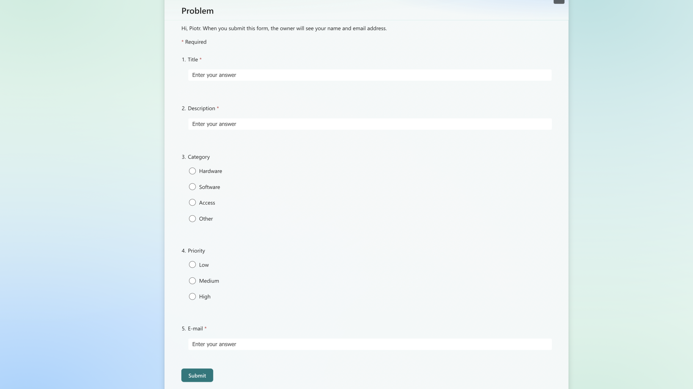
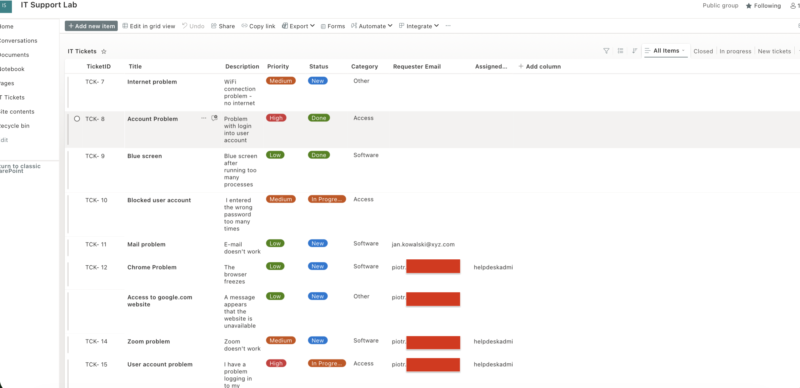
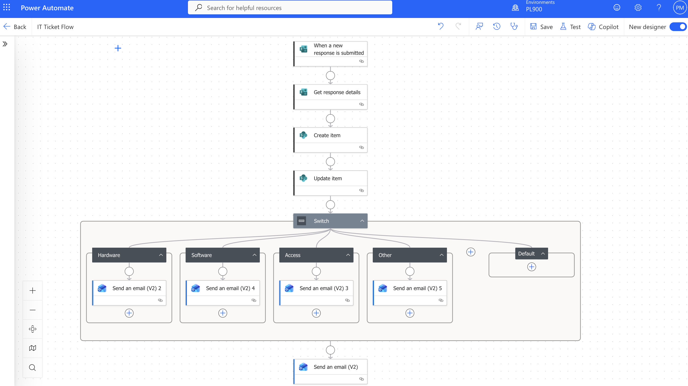
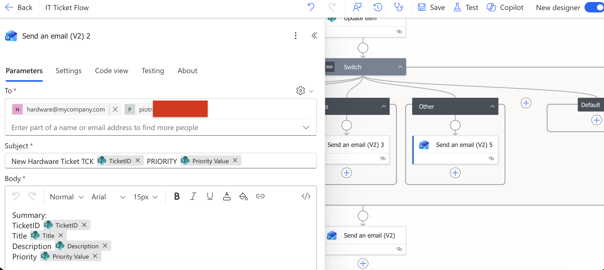
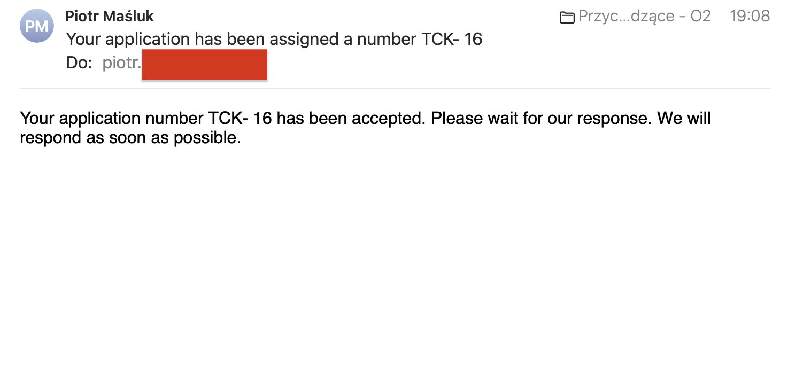
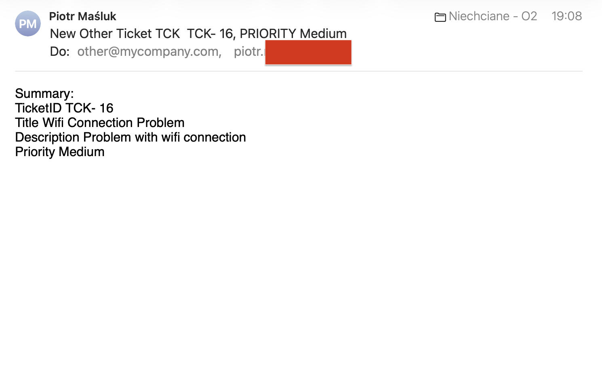

# IT Ticketing System (Power Platform)

This project is a simple IT ticketing system built using Microsoft Power Platform.
It simulates a real IT helpdesk process where user requests are automatically processed and assigned to the correct team.

## Purpose

The goal of this project is to understand how IT support workflows work in practice and how they can be automated using Microsoft tools.

## How it works

- 📋 User submits a request via Microsoft Forms  
- 📂 Data is stored in SharePoint  
- 🔄 Power Automate processes the request  
- 🆔 Ticket ID is generated  
- 📧 Confirmation email is sent to the user  
- 🧠 Request is routed using category (Hardware / Software / Access)

## Tools used

- Microsoft Forms  
- SharePoint Online  
- Power Automate  
- Microsoft 365  

## What I learned

- How IT ticket systems work  
- How automation connects Microsoft tools  
- Basic workflow logic and process thinking  
- How to structure IT support processes

## Screenshots

### 📝 Microsoft Forms
User submits a new IT support request.

### 📂 SharePoint list
All tickets are stored and tracked here.

### 🔄 Power Automate flow
Automation logic that processes and routes tickets.

### 🔄 Power Automate – Switch routing logic
This flow uses a Switch condition to route tickets to the correct department:
- 🖥 Hardware  
- 💻 Software  
- 🔐 Access Management  

### 📧 Email confirmation
Automatic email sent to user after ticket creation.

Automatic email sent to correct department after ticket creation.

